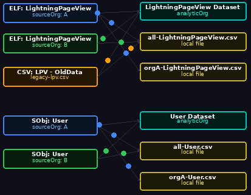

<!-- markdownlint-disable MD013 MD033 MD040 -- long table rows, intentional <details> blocks, and oclif-generated command-usage fences without language tags -->
# Dataset Loader

[](https://scolladon.github.io/dataset-loader/dev/bench/runtime/)

SF CLI plugin that loads Salesforce [Event Log Files](https://developer.salesforce.com/docs/atlas.en-us.object_reference.meta/object_reference/sforce_api_objects_eventlogfile.htm) (ELF), SObject data, and CSV files into CRM Analytics datasets or local files using the [Analytics External Data API](https://developer.salesforce.com/docs/atlas.en-us.bi_dev_guide_ext_data.meta/bi_dev_guide_ext_data/bi_ext_data_object_externaldata.htm).

<p align="center">
  
</p>

## Table of Contents

- [Prerequisites](#prerequisites)
- [Installation](#installation)
- [Quick Start](#quick-start)
- [Config Reference](#config-reference)
- [Command Reference](#sf-dataset-load)
- [Development](#development)

## Prerequisites

- [Salesforce CLI](https://developer.salesforce.com/tools/salesforcecli) (`sf`) with authenticated orgs
- Node.js >= 18

<details>
<summary>Required Permissions</summary>

| Org                      | Permissions                                                                      |
|--------------------------|----------------------------------------------------------------------------------|
| **Source org** (ELF)     | `API Enabled`, `View Event Log Files` (`ViewEventLogFiles`)                      |
| **Source org** (SObject) | `API Enabled`                                                                    |
| **Analytic org**         | `API Enabled`, `Upload External Data to CRM Analytics` (`InsightsAppUploadUser`) |

</details>

## Installation

```bash
sf plugins install dataset-loader
```

## Quick Start

```bash
# 1. Create a config file
touch dataset-load.config.json
```

```json
{
  "entries": [
    {
      "eventLog": "LightningPageView",
      "interval": "Daily",
      "sourceOrg": "my-source-org",
      "targetOrg": "my-analytic-org",
      "targetDataset": "LightningPageView_dataset_APIName"
    },
    {
      "csvFile": "./data/accounts-export.csv",
      "targetOrg": "my-analytic-org",
      "targetDataset": "ImportedAccounts"
    }
  ]
}
```

```bash
# 2. Verify auth and permissions
sf dataset load --audit

# 3. Preview the plan
sf dataset load --dry-run

# 4. Run
sf dataset load
```

> **Note:**
>
> - **CRM Analytics targets** — the dataset must already exist with at least one prior completed upload. Create it via the CRM Analytics UI or a one-time dataflow before the first load.
> - **File targets** — omit `targetOrg` and set `targetFile` to a local file path. The file is created automatically.

## Config Reference

### Common Fields

All entry types share these output fields:

| Field            | Required | Description                                                                         |
|------------------|----------|-------------------------------------------------------------------------------------|
| `name`           | no       | Optional entry identifier. Used as watermark key override and for --entry filtering |
| `targetOrg`      | no       | SF CLI alias of the CRM Analytics org. Omit to write to a local file instead        |
| `targetDataset`  | no       | CRM Analytics dataset API name. Required when `targetOrg` is set                    |
| `targetFile`     | no       | Local file path to write output. Required when `targetOrg` is omitted               |
| `operation`      | no       | `"Append"` (default) or `"Overwrite"`                                               |
| `augmentColumns` | no       | Extra columns to append to every row (see the Augment Columns details below)        |

> **Type inference:** Entry type is inferred from shape — entries with `eventLog` are ELF, entries with `sObject` are SObject, entries with `csvFile` are CSV.

### ELF Entry

```json
{
  "sourceOrg": "source-org-alias",
  "targetOrg": "analytic-org-alias",
  "targetDataset": "ALM_LightningPageView",
  "eventLog": "LightningPageView",
  "interval": "Daily",
  "augmentColumns": { "OrgId": "{{sourceOrg.Id}}" }
}
```

| Field       | Required | Description                                                  |
|-------------|----------|--------------------------------------------------------------|
| `sourceOrg` | yes      | SF CLI alias of the org containing EventLogFiles             |
| `eventLog`  | yes      | EventLogFile type (e.g. `Login`, `LightningPageView`, `API`) |
| `interval`  | yes      | `"Daily"` or `"Hourly"` (Hourly requires Shield license)     |

### SObject Entry

```json
{
  "sourceOrg": "source-org-alias",
  "targetOrg": "analytic-org-alias",
  "targetDataset": "ALM_Accounts",
  "sObject": "Account",
  "fields": ["Id", "Name", "Industry", "CreatedDate"],
  "where": "Industry != null",
  "augmentColumns": { "OrgId": "{{sourceOrg.Id}}" }
}
```

| Field       | Required | Description                                                |
|-------------|----------|------------------------------------------------------------|
| `sourceOrg` | yes      | SF CLI alias of the source org                             |
| `sObject`   | yes      | SObject API name (e.g. `Account`, `Opportunity`)           |
| `fields`    | yes      | Array of field API names to query                          |
| `dateField` | no       | Field used for watermarking (default: `LastModifiedDate`)  |
| `where`     | no       | Additional SOQL WHERE clause                               |
| `limit`     | no       | Max number of records to fetch (appends `LIMIT n` to SOQL) |

### CSV Entry

```json
{
  "csvFile": "./data/accounts-export.csv",
  "targetOrg": "analytic-org-alias",
  "targetDataset": "ALM_ImportedAccounts",
  "augmentColumns": { "Source": "ManualExport" }
}
```

| Field     | Required | Description                        |
|-----------|----------|------------------------------------|
| `csvFile` | yes      | Path to the local CSV file to load |

> **Note:** CSV entries only support static `augmentColumns` values. Dynamic `{{sourceOrg.*}}` / `{{targetOrg.*}}` expressions are not supported.

<details>
<summary>Augment Columns</summary>

Append static or dynamic columns to every row. Values support mustache-style `{{token}}` interpolation, including mixed with static text (e.g. `"PROD-{{sourceOrg.Name}}"`):

| Token                | Resolves to                                             |
|----------------------|---------------------------------------------------------|
| `{{sourceOrg.Id}}`   | 18-char Organization Id of the source org               |
| `{{sourceOrg.Name}}` | Organization Name of the source org                     |
| `{{targetOrg.Id}}`   | 18-char Organization Id of the target CRM Analytics org |
| `{{targetOrg.Name}}` | Organization Name of the target CRM Analytics org       |
| Any other string     | Used as-is (static value)                               |

Column names may contain dots (e.g. `"Org.Name"`) as CRM Analytics supports dotted dimension names.

</details>

<details>
<summary>Grouping</summary>

Entries targeting the same destination are merged into a single write job:

- **CRM Analytics targets**: same `(targetOrg, targetDataset)` → single `InsightsExternalData` upload
- **File targets**: same `targetFile` path → single file write

All entries in a group must use the same `operation`.

</details>

<details>
<summary>State File & Watermarks</summary>

Watermarks are stored in a separate state file (`.dataset-load.state.json`) to keep config declarative:

```json
{
  "watermarks": {
    "source-org-alias:elf:LightningPageView:Daily": "2026-03-05T00:00:00.000+0000",
    "source-org-alias:sobject:Account": "2026-03-05T14:30:00.000+0000"
  }
}
```

Watermark keys: `{sourceOrg}:elf:{eventLog}:{interval}`, `{sourceOrg}:sobject:{sObject}`, or `csv:{csvFile}`.

> Set `name` on an entry to use it as the watermark key instead of the auto-generated one. This lets you rename source orgs or change event types without losing watermark history.

- **First ELF run** (no watermark): fetches only the latest record (bootstrap mode)
- **First SObject run** (no watermark): fetches all matching records (use `limit` to cap)
- **Subsequent runs**: fetch incrementally from the stored watermark

</details>

<!-- commands -->
* [`sf dataset load`](#sf-dataset-load)

## `sf dataset load`

Load Event Log Files and SObject data into CRM Analytics datasets

```
USAGE
  $ sf dataset load [--json] [--flags-dir <value>] [-c <value>] [-s <value>] [--audit] [--dry-run] [--entry
    <value>]

FLAGS
  -c, --config-file=<value>  [default: dataset-load.config.json] Path to config JSON
  -s, --state-file=<value>   [default: .dataset-load.state.json] Path to watermark state file
      --audit                Pre-flight checks only (auth, connectivity, permissions)
      --dry-run              Show plan without executing
      --entry=<value>        Process only the entry with this name

GLOBAL FLAGS
  --flags-dir=<value>  Import flag values from a directory.
  --json               Format output as json.

EXAMPLES
  $ sf dataset load

  $ sf dataset load --config-file my-config.json --dry-run
```

_See code: [src/commands/dataset/load.ts](https://github.com/scolladon/dataset-loader/blob/main/src/commands/dataset/load.ts)_
<!-- commandsstop -->

<details>
<summary>Exit Codes</summary>

| Code | Meaning                                                            |
|------|--------------------------------------------------------------------|
| `0`  | All entries processed successfully                                 |
| `1`  | Partial success (some entries failed, some succeeded)              |
| `2`  | Fatal error (config invalid, all entries failed, or audit failure) |

</details>

<details>
<summary>How It Works</summary>

1. **Parse config** — validate JSON with Zod, check operation consistency across groups
2. **Resolve** — authenticate orgs, resolve mustache tokens in augmentColumns
3. **Audit** (optional) — verify connectivity, EventLogFile access, InsightsExternalData write access
4. **Execute pipeline** — group entries by dataset, stream through Reader → Augment → Writer
5. **Write** — CRM Analytics: gzip-compress, base64-encode, split into 10 MB parts, upload via InsightsExternalData API. File: stream rows directly to a local CSV
6. **Update watermarks** — only for entries whose group uploaded successfully

</details>

## Development

See [CONTRIBUTING.md](CONTRIBUTING.md) for development guidelines and [DESIGN.md](DESIGN.md) for architecture details.
